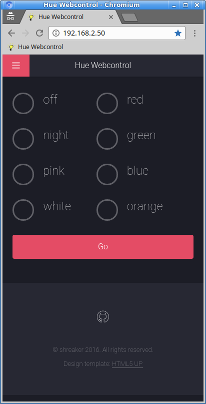

# Hue-Webcontrol

Control Phillips Hue lamps with a responsive webpage from any device in a simple way.
More convienent usability for controlling Hue lamps compared to the original Philips Hue App.

See: https://shreaker.github.io/Hue-Webcontrol/

Quick access for:
- Turn all lamps OFF
- Turn on the color: RED, GREEN, BLUE, PINK, ORANGE, WHITE, NIGHT(special mode)

Tested the responsive design of the webpage with following devices:
- RaspberryPi official display: 800x480
- Android smartphone: 480×800
- Win10 smartphone: 1280x720
- Desktop: 1920x1080

Web App:
- Use your favourite browser and create a link to the Hue-Webcontrol webpage. Add the link to your home-screen.
- The icon of the Web App is a light bulb (see favicon).

# Dependency
Software:
- Deploy Hue-Webcontrol on a webserver: NGINX | Apache with PHP5 or later
- Phue library: https://github.com/sqmk/Phue

Hardware:
- Phillips Hue Bridge and lamps: http://www.developers.meethue.com/
- Tested with Hue Bloom: http://www2.meethue.com/en-us/productdetail/philips-hue-bloom

# Restriction
- No user authentificiation. 
- If the website is exposed to the internet anybody can control your lights!
- Use only in a secure/trusted LAN.
